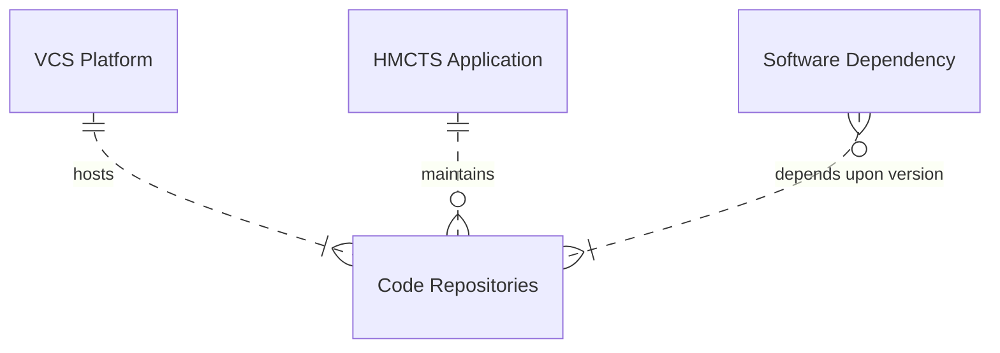
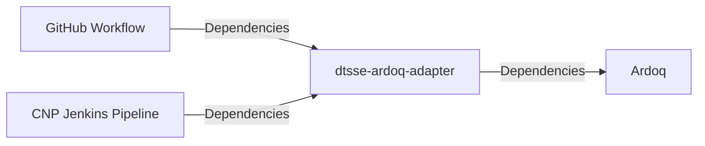

# dtsse-ardoq-adapter

Provides an integration to Ardoq in order to maintain the tech stack. The relationship for Ardoq components is like so:



This application is a NodeJS application that runs in CFT and hosts an API that is called by
HMCTS applications and the CNP Pipeline to update Ardoq with its dependencies.



## Getting Started with Integration

There are currently 3 methods of integration. You will need to know your Ardoq Application ID for all of them.

The Ardoq Application ID can be found by logging into the Ardoq web portal, finding your application ini the 'HMCTS
Applications' workspace and using the `component id` for the application.

### 1. Using the CNP Jenkins Pipeline

If your application is deployed using the standard CNP Pipeline then you need to onboard your application by raising a
Pull Request such as this one: https://github.com/hmcts/cnp-jenkins-config/pull/977/files

Once this config PR is merged, your teams application data shout start appearing in Ardoq after your next master build.

### 2. Using the API directly

You will need to request an API key from the DTSSE team who can be found on the MoJ slack workspace in #rse-dev-tools.

You will need to `POST` the following payload to the `/api/dependencies`.

```json
{
  "vcsHost": "Github HMCTS",
  "hmctsApplication": "YOUR_APPLICATION_ID_HERE",
  "codeRepository": "${{ github.event.repository.name }}",
  "encodedDependecyList": "",
  "parser": "yarn",
  "language": "",
  "languageVersion": ""
}
```

The full [OpenAPI spec](src/main/openapi.yaml) is included in this repository.

Some fields require additional clarification:

- language - The main language used in the application eg. java, nodejs, python etc.
- languageVersion - The version of the language used in the application eg. 11, 14, 3.8 etc.
- encodedDependencyList - The base64 encoded list of dependencies for the application. See the [Supported Build Tools](#supported-build-tools) section for more information on how to get this data.

### 3. Using GitHub Workflows

Below is a sample GitHub workflow. for a yarn application.

```name: Maintain Ardoq Tech Stack
name: Maintain Ardoq Tech Stack
run-name: ${{ github.actor }} Maintaining Ardoq Tech Stack. 🚀
on:
  push:
    branches:
      - master
      - main
jobs:
  Maintain-Ardoq-Tech-Stack:
    runs-on: ubuntu-latest
    steps:
      - run: echo "🔎 The name of your branch is ${{ github.ref }} and your repository is ${{ github.repository }}."
      - name: Check out repository code
        uses: actions/checkout@v3

      - run: echo "💡 The ${{ github.repository }} repository has been cloned to the runner."
      - name: List dependencies
        run: |
          cat yarn.lock | base64 > yarn.lock.b64
        id: deps

      - name: Prepare request payload
        run: |
          echo -n '{
            "vcsHost": "Github HMCTS",
            "hmctsApplication": "YOUR_APPLICATION_ID_HERE",
            "codeRepository": "${{ github.event.repository.name }}",
            "encodedDependecyList": "' > payload.json
          cat yarn.lock.b64 | tr -d '\n' >> payload.json
          echo -n '",
            "parser": "yarn",
            "language": "' >> payload.json
          grep -E '^FROM' Dockerfile | awk '{print $2}' | awk -F ':' '{printf("%s", $1)}' | tr '/' '\n' | tail -1 >> payload.json
          echo -n '",
            "languageVersion": "' >> payload.json
          grep -E '^FROM' Dockerfile | awk '{print $2}' | awk -F ':' '{printf("%s", $2)}' >> payload.json
          echo -n '"
            }' >> payload.json

      - name: compress body
        run: |
          gzip payload.json

      - name: debug compression
        run: |
          ls -lah payload.json.gz

      - name: post deps to ardoq app
        run: |
          curl -w "%{http_code}" --location --request POST '${{ secrets.ARDOQ_ADAPTER_URL }}?async=true' \
            --header 'Authorization: Bearer ${{ secrets.ARDOQ_ADAPTER_KEY }}' \
            --header 'Content-Type: application/json' \
            --header 'content-encoding: gzip' \
            --data-binary '@payload.json.gz'

      - run: echo "🍏 This job's status is ${{ job.status }}."
```

## Supported Build Tools

The following sections of the supported build tools will describe how to get the correct
payload to submit to the different endpoints for your built tool.

### Gradle

`./gradlew -q dependencies > $PWD/deps.log` will provide the full output of the dependencies used but needs to be base64
encoded before sending to the API. The following command will do this for you:
`cat $PWD/deps.log | base64 > $PWD/deps.log.base64`
This data then needs posting to the `/api/gradle/<your repository name>` endpoint.

### Maven

For maven projects you can run `mvn dependency:tree > $PWD/deps.log`

This data then needs posting to the `/api/maven/<your repository name>` endpoint.

### Dotnet

`dotnet list package --format json` will output the json content you need to then post to `/api/dotnet/<your repository name>`.

### NPM

To integrate your project when using npm, you simply need to post the contexts of your package-lock.json file to
`/api/npm/<your repository name>`. This works for both version 1 and 2 of the npm lock file.

### Yarn

To integrate your project when using yarn, you simply need to post the contexts of your yarn.lock file to
`/api/yarn/<your repository name>`.

### PIP

To integrate your project when using pip, you simply need to post the contexts of your requirements.txt file to
`/api/pip/<your repository name>`.

## Maintaining this application

### Prerequisites

Running the application requires the following tools to be installed in your environment:

- [Node.js](https://nodejs.org/) v12.0.0 or later
- [yarn](https://yarnpkg.com/)
- [Docker](https://www.docker.com)

### Running the application

Install dependencies by executing the following command:

```bash
$ yarn install
```

Bundle:

```bash
$ yarn webpack
```

Run:

```bash
$ yarn start
```

The applications's home page will be available at https://localhost:8506

### Running with Docker

Create docker image:

```bash
  docker-compose build
```

Run the application by executing the following command:

```bash
  docker-compose up
```

This will start the frontend container exposing the application's port
(set to `8506` in this template app).

In order to test if the application is up, you can visit https://localhost:8506 in your browser.
You should get a very basic home page (no styles, etc.).

## Developing

### Code style

We use [ESLint](https://github.com/typescript-eslint/typescript-eslint)
alongside [sass-lint](https://github.com/sasstools/sass-lint)

Running the linting with auto fix:

```bash
$ yarn lint --fix
```

### Running the tests

This template app uses [Jest](https://jestjs.io//) as the test engine. You can run unit tests by executing
the following command:

```bash
$ yarn test
```

Here's how to run functional tests (the template contains just one sample test):

```bash
$ yarn test:routes
```

Running accessibility tests:

```bash
$ yarn test:a11y
```

Make sure all the paths in your application are covered by accessibility tests (see [a11y.ts](src/test/a11y/a11y.ts)).

### Security

#### CSRF prevention

[Cross-Site Request Forgery](https://github.com/pillarjs/understanding-csrf) prevention has already been
set up in this template, at the application level. However, you need to make sure that CSRF token
is present in every HTML form that requires it. For that purpose you can use the `csrfProtection` macro,
included in this template app. Your njk file would look like this:

```

...
<form ...>
  ...
    {{ csrfProtection(csrfToken) }}
  ...
</form>
...
```

### Healthcheck

The application exposes a health endpoint (https://localhost:8506/health), created with the use of
[Nodejs Healthcheck](https://github.com/hmcts/nodejs-healthcheck) library. This endpoint is defined
in [health.ts](src/main/routes/health.ts) file. Make sure you adjust it correctly in your application.
In particular, remember to replace the sample check with checks specific to your frontend app,
e.g. the ones verifying the state of each service it depends on.

## License

This project is licensed under the MIT License - see the [LICENSE](LICENSE) file for details
